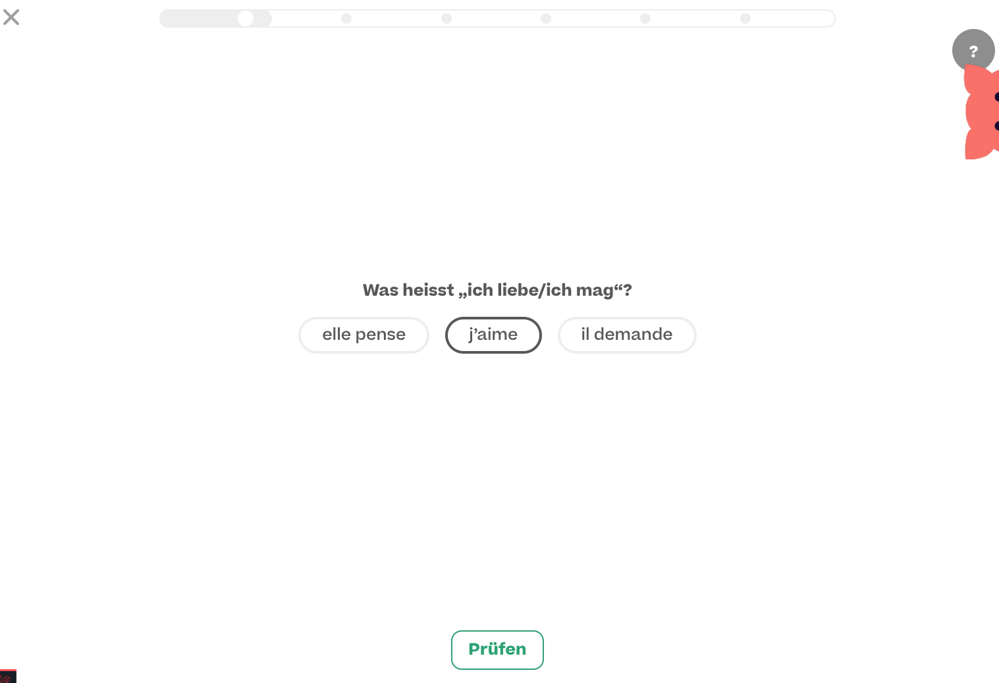
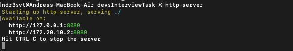

# DEVS INTERVIEWEES TASK
Coding Task for Full Stack Developer at evulpo

# PURPOSE
This repository provides the interviewees with an applied coding exercise to checkup development, research, communication, frontend and backend skills. During the following days applicants have time and space to solve the task described bellow.

# TASK DESCRIPTION

Create a Single Choice Exercise Viewer, where you can go circulate in a random order through a collection of exercises, solve them, evaluate them and get back the score. For this you can use the Google Sheet database we set for you right here:
https://docs.google.com/spreadsheets/d/1hzA42BEzt2lPvOAePP6RLLRZKggbg0RWuxSaEwd5xLc/edit?usp=sharing

1. Download this repository and start a new repository on your Github account with a copy of this repo. Please DO NOT start a branch or a fork from this repository. 
2. Connect with the GOOGLE Sheet and retreive the data base over the API for this. We provide a code sample for that (CODE_SAMPLE_GAPI_CONNECTION)
3. Create the small web-app(website) using a simple file structure (index.html, main.js, style.css) -> We provide a code sample for that (CODE_SAMPLE_BASIC). Intentionally parts of the code have been deleted to avoid providing the solution but giving a hint and direction.
4. Try to commit often during your development process so that we can review the changes over time.
5. Document your work on the repository
6. Once you are done with your development, send me the link via Private Message on Slack to your github repository or to my email: andres@schlaufux.ch

# Visual Reference:

# OUR CURRENT DEVELOPMENT REFERENCE

https://ch-de.evulpo.com/lesson/245b1209-2adf-4bc6-a2f0-ae8030f3caa0/exercises/4001

# FOCUS FOR EVALUATION OF THE TASK

1. Communication and Code Readability
2. Interactivity
3. Data Connection and States
4. Memory Load and Performance
5. Front End

# GOOD TO KNOW

* Due to Cross Origin restrictions while using gapi, you need to run your application and connect to the google api (gapi) you need to start a server using npm or npx  http-server

https://www.npmjs.com/package/npx-server

https://www.npmjs.com/package/http-server

* we provide a reference code solving the exercise single choice for you to use as a reference (CODE_SAMPLE_BASIC)

# DEADLINE
Thursday 27th of January 2022 23:59 Zürich Time. If needed upon request we can extend this deadline. 

# HAVE FUN AND GOOD LUCK!
# schlaufux-task
